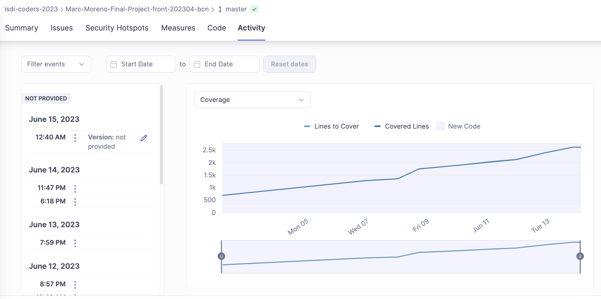

# Extintores - Frontend project

Frontend project for the Extintores app. This application shows a public list of extinguishers. The logged user can create new ones and delete or update extinguishers created by him.

Figma design: https://www.figma.com/file/4kySDGAqAGKQk79UoxEPoS/Extintores?type=design&mode=design&t=GbmGjf4IdKzWEOnZ-1

Follow the link to access the back repository: https://github.com/isdi-coders-2023/Marc-Moreno-Final-Project-back-202304-bcn

## Scripts

---

`npm run dev`: starts a development server

`npm run build`: builds the app

`npm run preview`: runs the built app

`npm run lint`: runs ESLint

`npm run test`: runs tests  
 

## Tech Stack

---

🔸React (https://es.react.dev/)  
🔸Redux-Toolkit (https://redux.js.org/)
🔸Styled-components (https://styled-components.com/)
🔸Axios (https://axios-http.com/docs/intro)
🔸Jwt-decode (https://jwt.io/)
 

### **Deploy**

🔸Netlify (https://www.netlify.com/)  
 

### **Languages**

🔸Typescript (https://www.typescriptlang.org/docs/)  
 

### **Good Practices Tools**

🔸Husky hooks (https://typicode.github.io/husky/#/)  
🔸Eslint (https://eslint.org/)  
🔸Code formatter Prettier (https://prettier.io/)  
🔸Editorconfig  
🔸SonarCloud (https://www.sonarsource.com/products/sonarcloud/)

History of coverage during the project:

 

### **Testing**

🔸React Testing Library (https://testing-library.com/)  
🔸Vitest (https://vitest.dev/)  
🔸Mock Service Worker (https://mswjs.io/)  
🔸Fishery (https://github.com/thoughtbot/fishery)  
🔸Faker-js (https://fakerjs.dev/)

---

 

## Performance

